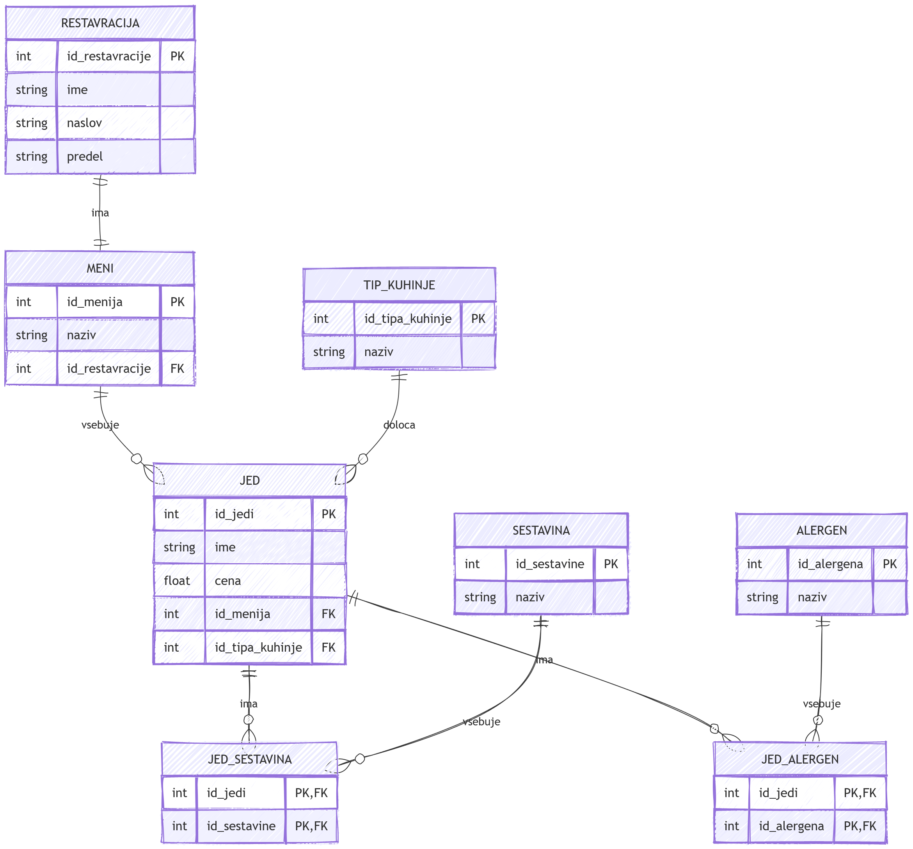

# Restavracije v Ljubljani

Seminarska naloga pri predmetu Podatkovne baze 1.

## Namen projekta

Namen projekta je izdelava podatkovne baze restavracij v Ljubljani in aplikacije, ki uporabniku omogoča pregledovanje restavracij, njihovih menijev in jedi.

Pri posamezni jedi so shranjeni tudi podatki o sestavinah, alergenih in tipu kuhinje.

## ER diagram

Spodnji diagram prikazuje strukturo podatkovne baze in povezave med tabelami.



## Funkcionalnosti

Projekt omogoča:

- pregled restavracij v Ljubljani,
- pregled jedi posamezne restavracije,
- pregled sestavin posamezne jedi,
- pregled alergenov posamezne jedi,
- iskanje restavracij glede na predel Ljubljane,
- iskanje restavracij glede na tip kuhinje.

## Podatkovna baza

Podatkovna baza je izdelana v SQLite.

Glavne tabele so:

- `Restavracija`
- `Meni`
- `Jed`
- `Tip_Kuhinje`
- `Sestavina`
- `Alergen`
- `Jed_Sestavina`
- `Jed_Alergen`

Tabeli `Jed_Sestavina` in `Jed_Alergen` predstavljata povezovalni tabeli za relaciji mnogo-proti-mnogo.

Restavracije vsebujejo tudi podatek o predelu Ljubljane, kar omogoča iskanje restavracij s pomočjo zemljevida.

Začetni podatki so shranjeni v CSV datotekah v mapi `podatki`. Podatkovna baza se ustvari s programom `ustvari_bazo.py`, zato datoteka podatkovne baze ni vključena v repozitorij.

## Tekstovni vmesnik

Program `tekstovni_vmesnik.py` omogoča osnovno delo z bazo preko terminala.

Uporabnik lahko:

- izpiše vse restavracije,
- prikaže jedi izbrane restavracije,
- prikaže sestavine in alergene izbrane jedi.

Program uporabnika obvesti tudi v primeru vnosa neveljavnega ID-ja restavracije ali jedi.

## Spletni vmesnik

Program `spletni_vmesnik.py` uporablja knjižnico Bottle.

Spletni vmesnik omogoča izbiro restavracij glede na predel Ljubljane s pomočjo interaktivnega SVG zemljevida.

Uporabnik lahko restavracije išče tudi glede na tip kuhinje.

Po izbiri restavracije lahko pregleda njene jedi, pri posamezni jedi pa sestavine in alergene.

HTML predloge spletnega vmesnika so shranjene ločeno od Python kode v mapi `views`.

## Struktura projekta

- `podatki/` - CSV datoteke z začetnimi podatki
- `model.py` - povezava s podatkovno bazo in SQL poizvedbe
- `ustvari_bazo.py` - ustvari SQLite podatkovno bazo iz CSV datotek
- `tekstovni_vmesnik.py` - tekstovni uporabniški vmesnik
- `spletni_vmesnik.py` - spletni uporabniški vmesnik
- `views/` - HTML predloge spletnega vmesnika
- `static/ljubljana.svg` - interaktivni zemljevid Ljubljane
- `diagram.png` - ER diagram podatkovne baze

## Zagon programa

### 1. Prenos projekta

Prenesi oziroma kloniraj celoten repozitorij. Pomembno je, da struktura datotek ostane nespremenjena:

```text
Restavracije-v-Ljubljani/
│
├── podatki/
│   ├── alergeni.csv
│   ├── jedi.csv
│   ├── jed_alergen.csv
│   ├── jed_sestavina.csv
│   ├── meniji.csv
│   ├── restavracije.csv
│   ├── sestavine.csv
│   └── tipi_kuhinje.csv
│
├── static/
│   └── ljubljana.svg
│
├── views/
│   ├── jed.tpl
│   ├── restavracija.tpl
│   ├── restavracije.tpl
│   └── zacetna.tpl
│
├── diagram.png
├── model.py
├── spletni_vmesnik.py
├── tekstovni_vmesnik.py
├── ustvari_bazo.py
└── README.md
```

Mape `podatki`, `static` in `views` morajo ostati v glavni mapi projekta skupaj s Python datotekami.

### 2. Namestitev knjižnice Bottle

Za delovanje spletnega vmesnika je potrebna knjižnica Bottle.

V ukazni vrstici oziroma terminalu zaženi:

```bash
pip install bottle
```

Knjižnica `sqlite3`, ki jo program uporablja za delo s podatkovno bazo, je že vključena v Python in je ni treba dodatno nameščati.

### 3. Ustvarjanje podatkovne baze

Pred prvim zagonom tekstovnega ali spletnega vmesnika je potrebno ustvariti podatkovno bazo.

V terminalu v mapi projekta zaženi:

```bash
python ustvari_bazo.py
```

Program iz CSV datotek v mapi `podatki` ustvari datoteko:

```text
RestavracijeVLjubljani.db
```

Ustvarjena baza se shrani v glavno mapo projekta in jo uporabljata oba uporabniška vmesnika.

Če se baza izbriše, jo je mogoče ponovno ustvariti z zagonom `ustvari_bazo.py`.

### 4. Tekstovni vmesnik

Za uporabo tekstovnega vmesnika odpri terminal v mapi projekta in zaženi:

```bash
python tekstovni_vmesnik.py
```

Program se bo zagnal neposredno v terminalu in ponudil možnosti za pregled restavracij, jedi, sestavin in alergenov.

Za izhod iz tekstovnega vmesnika izberi možnost `0`.

### 5. Spletni vmesnik

Tekstovnega vmesnika ni treba zagnati pred spletnim vmesnikom. Programa sta med seboj neodvisna in oba uporabljata isto podatkovno bazo.

Pred zagonom mora biti podatkovna baza ustvarjena s programom `ustvari_bazo.py`.

Za zagon spletnega vmesnika v terminalu v mapi projekta zaženi:

```bash
python spletni_vmesnik.py
```

Po zagonu se zažene lokalni Bottle strežnik.

Nato v spletnem brskalniku odpri:

```text
http://localhost:8080/
```

Na začetni strani je mogoče izbrati predel Ljubljane s klikom na interaktivni zemljevid ali poiskati restavracije glede na tip kuhinje.

Po izbiri restavracije je mogoče pregledati njene jedi, pri posamezni jedi pa tudi sestavine in alergene.

### 6. Zaustavitev spletnega vmesnika

Spletni strežnik ustaviš v terminalu s kombinacijo tipk:

```text
Ctrl + C
```

## Avtorja

Jure Kovač, Vanja Stanojević
